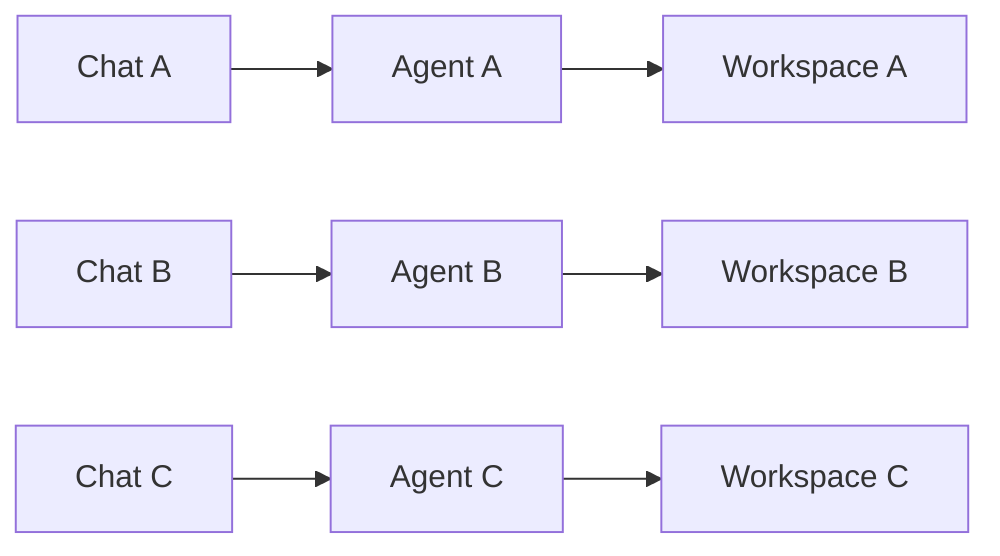
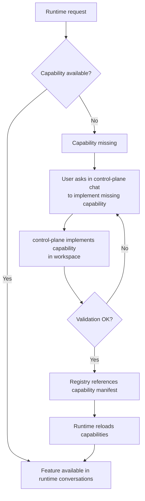

# Copilot Hub Architecture

## Planes

1. Hub plane (`apps/control-plane`)
- Single Telegram chat for operations commands and LLM development.
- Handles simple ops commands and forwards non-command requests to the LLM runtime.

2. Execution plane (`apps/agent-engine`)
- Runs worker agents and channels.
- Manages sessions, policies, capabilities, and projects.
- Exposes runtime HTTP API.

## Shared packages

- `packages/contracts`: control-plane action contract and validators.
- `packages/core`: shared workspace boundary policy utilities.
- `packages/capabilities`: reusable capability modules.

## Boundary model

- Control actions are defined once in `packages/contracts`.
- Workspace roots are validated against a shared boundary policy.
- Agent workspaces are blocked inside the kernel directory.

## Workspace isolation and concurrency

Each agent runs with its own workspace root.

Result:
- many chats can run in parallel
- many projects can run in parallel
- file/state collisions between agents are avoided by design

## Capability lifecycle

## Channel governance

- Channels are core adapters, not workspace capabilities.
- Channel changes are reviewed as core changes because they impact entry points and secrets.

## Reliability model

- Agent workers are isolated per bot.
- Control-plane updates write registry first, then apply runtime updates with rollback on failure.
- Service lifecycle is managed by the local supervisor (`scripts/supervisor.mjs`).
