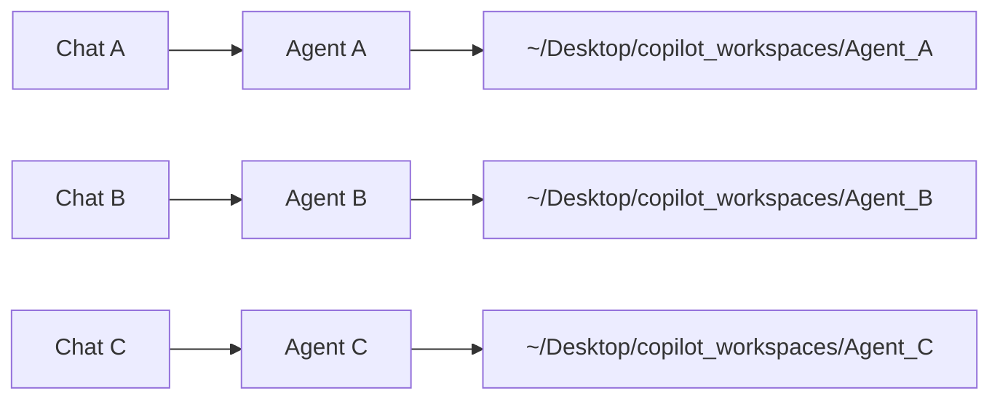
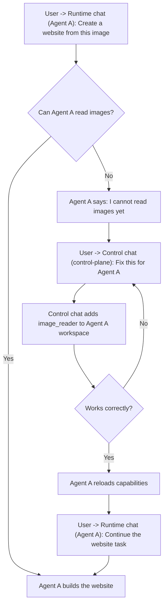

# Copilot Hub

Copilot Hub is a 2-plane monorepo for building and operating Telegram AI agents.

## Links

- GitHub repository: https://github.com/openminedev/copilot-hub
- npm package: https://www.npmjs.com/package/copilot-hub

## Planes

- `apps/control-plane`: single Telegram hub chat for operations commands and LLM development tasks.
- `apps/agent-engine`: execution plane (workers, channels, sessions, capabilities).

Shared packages:

- `packages/contracts`
- `packages/core`
- `packages/capabilities`

## Hub chat model

The same Telegram chat handles both operations and development:

- commands: `/help`, `/health`, `/bots`, `/create_agent`, `/cancel`
- normal message: handled by the LLM assistant

## Workspace isolation

Each runtime agent has its own dedicated `workspaceRoot`.



Why this matters:

- multiple chats can run at the same time without mixing files
- multiple projects can run in parallel on the same machine
- one agent change stays inside that agent workspace

## Control-plane role

- `control chat` is a simple maintenance chat: fix issues, add new capabilities, and create new agents.
- `runtime chats` are user-facing chats: execute tasks and deliver results.
- users stay in runtime chats for normal work and use control chat only when an agent needs a fix or upgrade.

## Example flow

Scenario: user asks a runtime chat (Agent A) to create a website from an image.



## Install from npm

```bash
npm install -g copilot-hub@latest
```

Then run:

```bash
copilot-hub start
```

`start` runs guided setup automatically if required values are missing.
On interactive terminals, `start` can also offer OS-native service installation when it is not yet configured.

## Quick start from source

1. Install dependencies:

```bash
npm install
```

2. Start services:

```bash
npm run start
```

`start` checks required tokens and prompts only if values are missing.
If you need to prefill values manually, run `npm run configure` first.

## Telegram setup

### 1) Create the control-plane (hub) bot token

1. Open Telegram and search for `@BotFather`.
2. Send `/start`.
3. Send `/newbot`.
4. Enter the bot display name you want.
5. Enter a unique username ending with `bot` (example: `my_copilot_hub_bot`).
6. BotFather returns a token like `123456789:AA...`.

Now run:

```bash
npm run start
```

When prompted, paste this token.

### 2) Open hub bot on Telegram

Open your hub bot in Telegram and send `/start`.

Hub commands:

- `/help`
- `/health`
- `/bots`
- `/create_agent`
- `/cancel`

### 3) Create runtime agent bot(s)

You need one Telegram bot token per runtime agent.

1. Go back to `@BotFather`.
2. Run `/newbot` again.
3. Create a new bot for the runtime agent.
4. Copy the new token.
5. In the hub chat, run `/create_agent` and follow the wizard:
   - Step 1: send the runtime agent token
   - Step 2: send agent id (or `default`)
   - Step 3: reply `YES`

You can use `/bots` in the hub chat to manage policy, reset context, or delete an agent.
Default values are already applied, and actions start from that agent workspace folder.

### 4) Token safety

- Never commit real bot tokens.
- If a token is leaked, regenerate it in `@BotFather` using `/revoke`.
- Keep local runtime files (`data/`, `logs/`) private.

## Startup troubleshooting

- If `npm run start` fails, first read the error and follow the suggested action.
- `npm run start` now auto-detects Codex from VS Code (Windows) and can install Codex CLI automatically if missing.
- For Codex login issues, run `codex login` (or the configured `CODEX_BIN`) and retry `npm run start`.
- If auto-install is skipped or unavailable, install Codex CLI with `npm install -g @openai/codex` or set `CODEX_BIN` in `.env`.
- If you are still stuck, ask your favorite LLM with the exact error output.

## Commands

```bash
npm run start
npm run stop
npm run restart
npm run status
npm run logs
npm run configure
npm run test
npm run lint
npm run format:check
npm run check:apps
```

Service mode (optional, OS-native):

```bash
copilot-hub service install
copilot-hub service status
copilot-hub service stop
copilot-hub service start
copilot-hub service uninstall
```

Service backend by OS:

- Windows: Task Scheduler (`CopilotHub`) with user-startup fallback if task creation is denied
- Linux: systemd user service (`copilot-hub.service`)
- macOS: launchd agent (`com.copilot-hub.service`)

## npm release (CI)

Publishing is automated from GitHub Actions on tags (`v*`).

Release flow:

```bash
npm version patch
git push origin main --follow-tags
```

The release workflow validates build/test/lint/format, checks that the tag version matches `package.json`, then publishes to npm.

Authentication options:

- Recommended: npm Trusted Publishing (OIDC/provenance)
- Fallback: set `NPM_TOKEN` in GitHub repository secrets

## Workspace policy

- Default workspace root: `~/Desktop/copilot_workspaces` when not explicitly set.
- `WORKSPACE_STRICT_MODE=true` enforces allowed roots.
- `WORKSPACE_ALLOWED_ROOTS` adds extra allowed roots.
- Workspaces inside kernel directories are rejected.

## Runtime files

- PIDs: `.copilot-hub/pids/`
- Logs: `logs/`

## Security

- Never commit real tokens.
- Keep `.env` and runtime data local.
- Rotate leaked tokens immediately.
